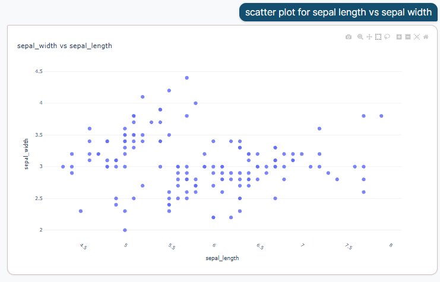
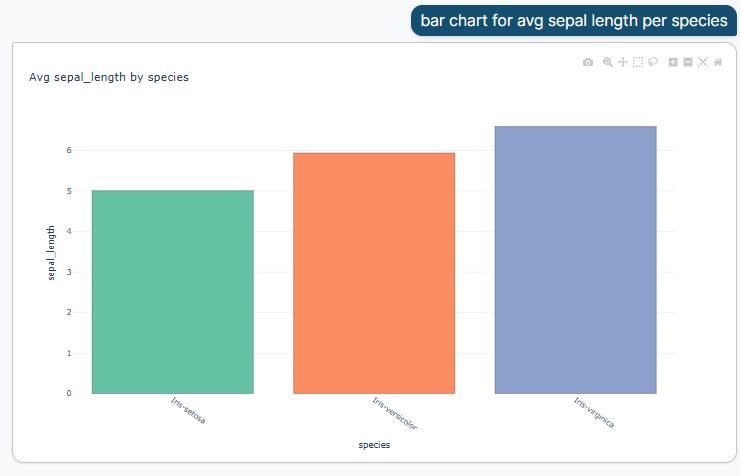
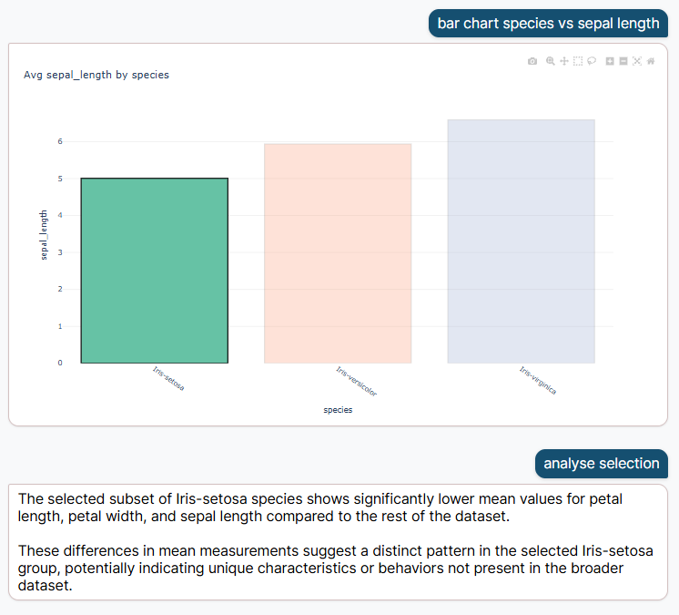

# CEDA – Conversational Exploratory Data Analysis

CEDA is a local, privacy-focused conversational data analysis tool that allows you to query your datasets using natural language. It combines a rule-based NLP parser with an LLM fallback to interpret queries and generate results and visualisations.

---





---

## Features

* Conversational language queries (average, sum, min, max, count)
* Data visualisation (bar, scatter, line, pie, histogram, box plot)
* LLM fallback for ambiguous queries using Phi-3.5-mini via llama.cpp
* Selection analysis using the `analyse` command
* Fully local execution to ensure data privacy

---

## Architecture

CEDA uses a client-server architecture:

* Frontend: React-based chatbot interface
* Backend: Flask API for query processing
* Components:

  * NLP handler (rule-based)
  * LLM fallback (llama.cpp)
  * Data processing (Pandas)
  * Visualisation (Plotly)

---


## Quick Start

### Prerequisites
Before you begin, make sure you have the following installed:
- **Python 3.8+** - Download from [python.org](https://www.python.org)
- **Node.js** (includes npm) - Download from [nodejs.org](https://nodejs.org)

Verify installation by running:
```bash
python --version
node --version
npm --version
```

### Setup & Run

1. **Clone the repository**
   ```bash
   git clone https://github.com/MiloBlake/CEDA.git
   cd CEDA/Data_Analysis_Chatbot
   ```

2. **Run the startup script**
   ```bash
   python start.py
   ```

   This script will:
   - Install all Python dependencies (backend)
   - Install all Node.js dependencies (frontend)
   - Start the backend server on `http://localhost:5000`
   - Start the frontend server on `http://localhost:3000`

3. **Open the application**
   - Frontend: http://localhost:3000
   - Backend API: http://localhost:5000

4. **Stop the servers**
   Press `Ctrl+C` in your terminal to stop all services

### Subsequent Runs
After the first run, dependency installation is skipped on subsequent runs (much faster). Just run:
```bash
python start.py
```

### Troubleshooting
- **"npm is not installed"**: Install Node.js from [nodejs.org](https://nodejs.org)
- **Port already in use**: Change ports in the configuration
- **Python version error**: Make sure you have Python 3.8 or higher installed

---

## Author

Milo Blake
